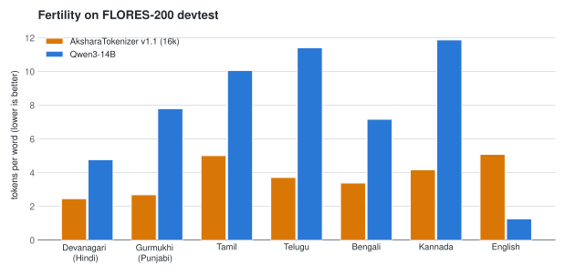
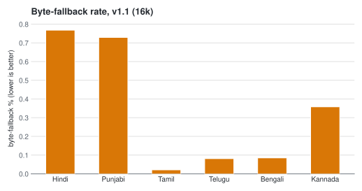

# IYRA Akshara Tokenizer (IAT)

Linguistically-correct tokenization for Brahmic (Indic) scripts. It has two layers:
a rule-based Akshara segmenter that never splits an orthographic syllable, and a
trained SentencePiece model on top of it.

## Supported Scripts

Rule-based segmentation covers six scripts:

| Script     | Languages                |
|------------|--------------------------|
| Devanagari | Hindi, Sanskrit, Marathi |
| Gurmukhi   | Punjabi                  |
| Tamil      | Tamil                    |
| Telugu     | Telugu                   |
| Bengali    | Bengali                  |
| Kannada    | Kannada                  |

## Why Akshara instead of BPE?

Byte-level BPE tokenizers split Brahmic text mid-character. A conjunct such as
ज्ञा, or a consonant plus vowel sign such as ਪੰ, is one orthographic syllable
(one Akshara), but BPE sees only UTF-8 bytes and cuts wherever its merges fall.
Captured output below: the same strings through the Qwen3-14B tokenizer and
through this tokenizer's segmenter. Each BPE token is decoded independently; a
`�` is a token that holds only a fragment of one character's bytes.

| Input | Qwen3-14B BPE tokens | Akshara segments |
|-------|----------------------|------------------|
| ज्ञान (Hindi) | `['ज', '्�', '�', 'ा�', '�']` (5 tokens) | `['ज्ञा', 'न']` (2 units) |
| ਪੰਜਾਬ (Punjabi) | `['ਪ', '�', '�', 'ਜ', '�', '�', 'ਬ']` (7 tokens) | `['ਪੰ', 'ਜਾ', 'ਬ']` (3 units) |
| நியாயம் (Tamil) | `['�', '�', 'ி�', '�', '�', '�', 'ய', 'ம', '்']` (9 tokens) | `['நி', 'யா', 'ய', 'ம்']` (4 units) |

No Akshara segment is ever a partial character, and no orthographic syllable is
split across tokens. The fertility tables below quantify the same effect
corpus-wide on FLORES-200.

## Pipeline

Two layers: a rule-based Akshara segmenter (pure Unicode rules, no model), then
a trained SentencePiece model over the segmented sequence. One real example end
to end, with the actual ids from the shipped 16,000-piece v1.1 model:

```
Unicode text        "न्याय दर्शन"
        |
rule-based akshara segmenter
        |
akshara sequence    ['न्या', 'य', ' ', 'द', 'र्श', 'न']
        |
SentencePiece (16k vocab, byte_fallback)
        |
pieces              ['▁न्या', '▁य', '▁द', '▁र्श', '▁न']
token ids           [1734, 338, 364, 1398, 270]
```

## Model

This release ships one trained SentencePiece model (byte_fallback enabled):

| Model | Vocab | Trained scripts | File |
|-------|------:|-----------------|------|
| v1.1 (six-script) | 16,000 | all six, with the anusvara fix | `akshara_tokenizer/model/akshara_tokenizer_v1_1.model` |

An earlier 7,000-vocab model trained on Hindi, Punjabi, and Tamil was the originally
filed artifact and is not distributed in this release.

## Fertility (verified)

FLORES-200 devtest, tokens per whitespace word (lower is better). Numbers from
`benchmark_2026_07/results_v1_1.md`.

| Script (language)  | v1.1 (16k) | Qwen3-14B |
|--------------------|-----------:|----------:|
| Devanagari (Hindi) | 2.45       | 4.77      |
| Gurmukhi (Punjabi) | 2.68       | 7.80      |
| Tamil (Tamil)      | 5.01       | 10.06     |
| Telugu (Telugu)    | 3.71       | 11.41     |
| Bengali (Bengali)  | 3.38       | 7.16      |
| Kannada (Kannada)  | 4.17       | 11.88     |
| English (info)     | 5.08       | 1.26      |



Byte-fallback rate, percent (lower is better):

| Script  | v1.1 (16k) |
|---------|-----------:|
| Hindi   | 0.77       |
| Punjabi | 0.73       |
| Tamil   | 0.02       |
| Telugu  | 0.08       |
| Bengali | 0.09       |
| Kannada | 0.36       |



v1.1 fertility is below Qwen3-14B on all six Indic scripts, and its Telugu, Bengali,
and Kannada byte-fallback is under 0.4 percent. On English, Qwen3 is more efficient,
as expected for an English-centric byte-level BPE.

Both charts are generated from `benchmark_2026_07/results_v1_1.csv` by
`benchmark_2026_07/make_charts_v1_1.py`, so they can be reproduced from the
shipped data.

## Install

Requires Python >=3.10 (as declared in `pyproject.toml`).

```bash
git clone https://github.com/1322Guru/akshara-tokenizer
cd akshara-tokenizer
pip install .             # rule-based segmenter only
pip install ".[model]"    # includes sentencepiece, needed for the trained model
```

The base install is all you need for `segment_aksharas` and `count_aksharas`.
The `model` extra is needed to encode with the trained SentencePiece model.

## Usage

Rule-based segmentation (no model needed):

```python
from akshara_tokenizer import segment_aksharas, count_aksharas

segment_aksharas("ਨਿਆਯ ਦਰਸ਼ਨ")
# ["ਨਿ", "ਆ", "ਯ", " ", "ਦ", "ਰ", "ਸ਼", "ਨ"]

segment_aksharas("ज्ञान")
# ["ज्ञा", "न"]

count_aksharas("ਪੰਜਾਬ")
# 3
```

Encoding with the trained model (segment, then SentencePiece):

```python
import sentencepiece as spm
from importlib.resources import files, as_file
from akshara_tokenizer import segment_aksharas

# Load the model from the installed package (works after pip install, no repo path needed)
model_res = files("akshara_tokenizer").joinpath("model", "akshara_tokenizer_v1_1.model")
with as_file(model_res) as model_path:
    sp = spm.SentencePieceProcessor(model_file=str(model_path))

ids = sp.encode(" ".join(segment_aksharas("न्याय दर्शन")))
```

## Akshara Formation Rules

1. C + virama + C forms a single conjunct (Devanagari, Telugu, Bengali, Kannada).
2. C + vowel sign forms one Akshara.
3. C + virama alone is a dead consonant and a complete Akshara.
4. An independent vowel is its own Akshara.
5. Anusvara, visarga, nukta, addak, tippi, bindi, and candrabindu attach to the
   preceding Akshara.
6. Latin letters, digits, and punctuation are one token each.

## Limitations (honest)

- Round-trip is not lossless. The tokenizer is encode-optimized. `decode(encode(text))`
  is not guaranteed to be byte-identical, because Akshara segmentation joins units with
  spaces and SentencePiece normalizes whitespace. Use it for tokenization and fertility,
  not for lossless reconstruction. A detokenizer is planned. (Verified: round-trip is not
  byte-identical for any script in results_v1_1.md.)
- Script coverage. Telugu, Bengali, and Kannada are well-supported from v1.1 onward; the
  earlier 7,000-vocab model covered only Hindi, Punjabi, and Tamil and is not shipped here.

## Run Tests

pytest is not part of the base install; get it via the dev extra, then run the suite:

```bash
pip install ".[dev]"
python -m pytest tests/ -v
```

## Script-level Notes

| Script     | Conjuncts | Notes |
|------------|-----------|-------|
| Devanagari | Yes | Standard C + virama + C conjuncts |
| Gurmukhi   | No  | Virama creates dead consonants; addak doubles the next consonant |
| Tamil      | No  | Pulli always creates a dead consonant |
| Telugu     | Yes | Conjuncts via virama |
| Bengali    | Yes | Hasanta conjuncts |
| Kannada    | Yes | Conjuncts via virama |

## Direction

Akshara-based segmentation is one instance of a more general idea: tokenizing
on the orthographic units a writing system is built from, rather than on bytes.
The same principle extends to other syllable-block writing systems.

## Patent and Copyright

Patent pending: Indian provisional patent application 202611071450.
Copyright 2026 Gursimran Singh.

## License

Apache License 2.0. See `LICENSE` and `NOTICE`.
